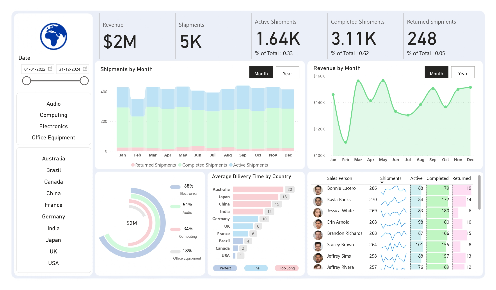

# Shipment & Revenue Performance Dashboard

## 🧠 About the Dashboard
The **Shipment & Revenue Performance Dashboard** delivers a comprehensive overview of logistics and sales operations by analyzing shipments, delivery efficiency, return rates, and revenue performance across categories and geographies.

It empowers operations, logistics, and sales teams to optimize delivery timelines, reduce return rates, and focus on high-performing product segments and sales personnel.

 **Overview**

  

## 📌 Project Overview
This Power BI dashboard visualizes key shipment and revenue insights across time, countries, product categories, and sales representatives using transactional shipment data from 2022 to 2024.

### 💼 Business Problem

> **"How can a company reduce delivery delays and returns while maximizing shipment revenue and sales performance across regions and categories?"**

This dashboard addresses business-critical challenges by enabling:

- 🚛 Monitoring of **shipment volume trends by month and status** (Completed, Active, Returned).
- 🌎 Evaluation of **average delivery time by country** to identify logistical inefficiencies.
- 📦 Analysis of **return rates by geography** to address customer experience issues.
- 💰 Insight into **revenue generation by product category and salesperson**.
- 🧑‍💼 Measurement of **sales team performance based on shipment and revenue data**.

The insights provided can significantly impact decision-making in **sales strategy**, **regional planning**, and **product focus**.

---

### 📂 Project Structure
- **Shipment & Delivery Performance.sql:**
  - Shipment counts by status
  - Monthly shipment trends
  - Average delivery times by country
  - Return rate analysis

- **Sales & Revenue Performance.sql:**
  - Revenue by month and product category
  - Salesperson-based shipment and revenue performance

- **Shipment Analysis Dashboard.pdf:**
   -Power BI visualization summarizing the metrics above

---

## 📈 Key Dashboard Features

1. **Shipment KPIs**
   - Total Shipments: **5,000**
   - Active Shipments: **1,640** (33%)
   - Completed Shipments: **3,110** (62%)
   - Returned Shipments: **248** (5%)
   - Revenue: **$2 Million**

2. **Time-Based Analysis**
   - **Shipments and Revenue track** 
  - **Peak shipment and revenue months** visualized in bar graphs

3. **Delivery Insights**
   - **Average Delivery Days by Country:**:
     - Highest: **Australia (~20 days)**
     - Lowest: **USA (~1 day)**

4. **Product Category Revenue**
     - Electronics: **68%**
     - Audio: **51%**
     - Computing: **34%**
     - Office Equipment: **18%**
       
---

## 💡 Insights

- **🌍 Delivery Performance**
     - Countries like** Australia and Japan have higher average delivery times** (~18–20 days), suggesting inefficiencies or logistical challenges.
     - **USA and Canada show significantly lower delivery times** (~4–6 days), indicating smoother operations.

- **🔁 Return Analysis**
     - Return rates vary significantly by geography.
     - High return regions highlight the need for quality control or better product-market fit strategies.
 
- **🧑‍💼 Sales Performance**
     - Top Salespersons by Completed Shipments:
       - **Stacey Brown:** 101 completed shipments
       - **Erin Arnold:** 98 completed shipments
     - Salespersons with higher active/returned shipments may require process or training reviews.
     - Revenue contributions are closely tied to salesperson performance, indicating the importance of effective sales enablement.
      
- ⚠️ High return rates in certain countries may indicate issues with product quality or local logistics.
- 📍 Longer delivery times in regions like Australia and Japan suggest opportunities for route or carrier optimization.
- 🏆 Electronics and Audio are revenue leaders, guiding inventory and marketing strategies.

---

## 🛠️ Tools & Technologies
- Power BI Desktop
- Excel / CSV (Data Sources)
- DAX (for measures and KPIs)
- SQL-based data modeling
